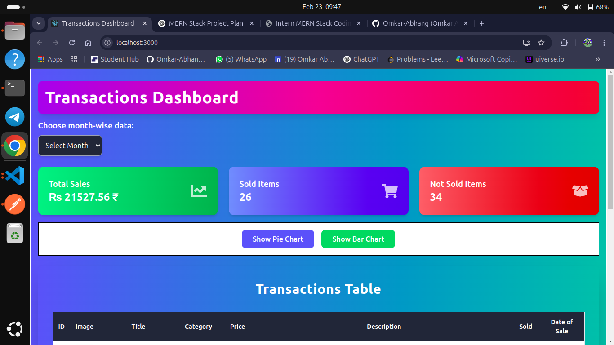
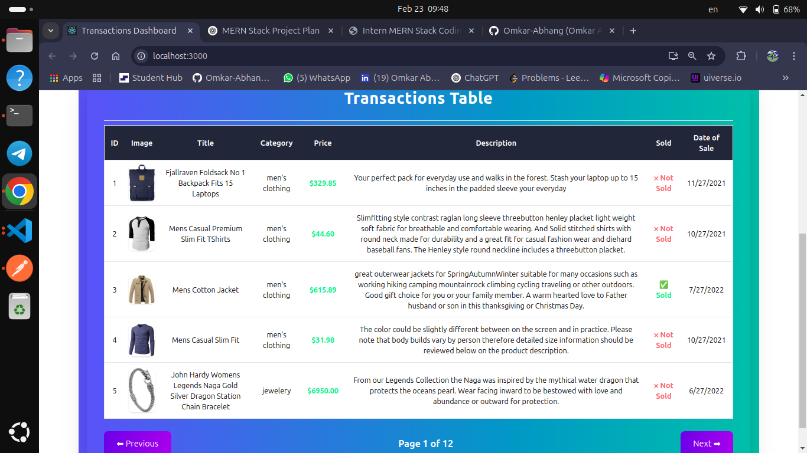
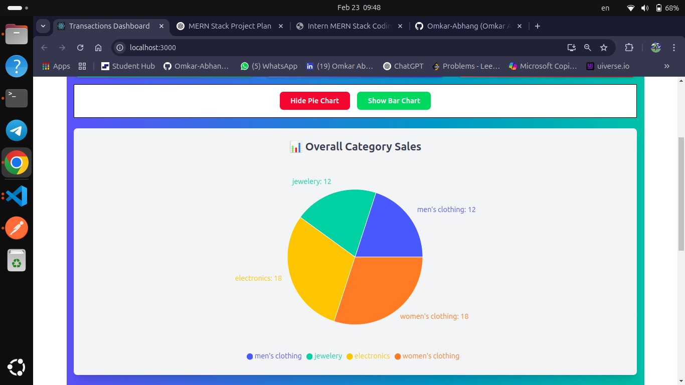
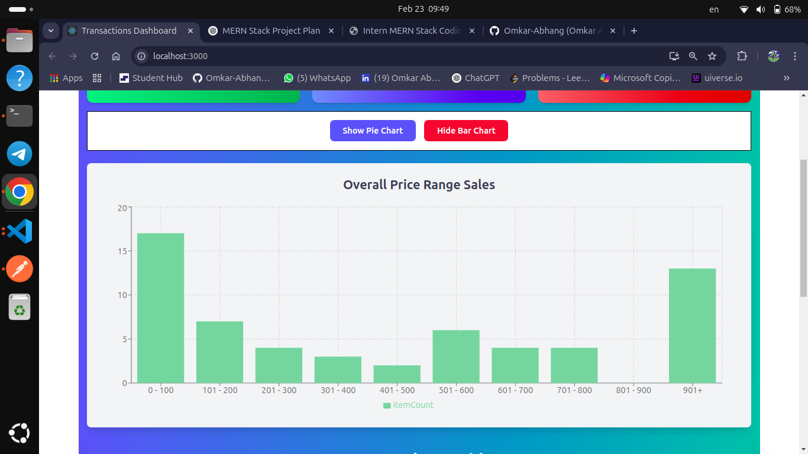

# 📊 MERN Transactions Dashboard

A **MERN Stack Application** for managing and visualizing **financial transactions**.  
It includes **dynamic charts, category analysis, and filtering** using React, Node.js, Express, and MongoDB.



---

## 🚀 Features
- ✅ **User-Friendly Dashboard** with **Pie Chart & Bar Chart**
- ✅ **Searchable Transactions Table** with Pagination
- ✅ **Category-Wise Sales (Pie Chart)**
- ✅ **Price Range Analysis (Bar Chart)**
- ✅ **Month-Based Filtering**
- ✅ **Combined API to Fetch All Data**
- ✅ **Toggle Buttons to Show/Hide Charts**

---

## 🏗️ Tech Stack
| Technology    | Description |
|--------------|-------------|
| **MongoDB**  | NoSQL Database |
| **Express.js** | Backend API Server |
| **React.js**  | Frontend UI |
| **Node.js**   | JavaScript Runtime |
| **Recharts** | Data Visualization |
| **TailwindCSS** | UI Styling |
| **Axios**    | API Requests |

---

## 📸 Screenshots

### Dashboard


### Transactions Table


### Pie Chart - Category Wise


### Bar Chart - Price Ranges


---

## 🔥 Installation & Setup

### 1️⃣ Clone the Repository
```
git clone https://github.com/UmeshChvhanTech
cd Roxiler-Assessment-submission
```

### 2️⃣ Backend Setup
📌 Install Dependencies
```
cd backend
npm install
```
📌 Start MongoDB
```
sudo systemctl start mongod
```
📌 Run Backend Server
```
node server.js
Backend runs on: http://localhost:5000
```

### 3️⃣ Frontend Setup
📌 Install Dependencies
```
cd frontend
npm install
```
📌 Start React Frontend
```
npm start
Frontend runs on: http://localhost:3000
```
## 📡 API Endpoints

### Method	Endpoint	Description

GET	/api/transactions	Fetch paginated transactions

GET	/api/pie-chart	Get category-wise item counts

GET	/api/bar-chart	Get price range analysis

GET	/api/combined-data	Fetch all API data in one response

## 🎨 UI Features
 
🎯 Dropdown for Month Selection

📊 Pie Chart (Category-Wise Analysis)

📈 Bar Chart (Price Analysis)

🎛 Toggle Buttons to Show/Hide Charts

📋 Table with Search & Pagination


## 🚀 Deployment

Deploy Frontend to Vercel
```
npm install -g vercel
vercel
```

Deploy Backend to Render

Push your code to GitHub
Create a new service on Render
Set the root directory as backend
Add environment variables for MongoDB
Deploy & get a public URL

## 🛠 Future Improvements
✅ User Authentication

✅ Download Transactions as CSV

✅ Dark Mode Theme

✅ Admin Panel for Managing Transactions


## 📜 License
This project is open-source under the MIT License.

## 🤝 Contributing
Feel free to submit issues & pull requests to improve this project!

## Contributors
👨‍💻 Umesh Chavhan 

## 🔗 Follow Me
LinkedIn: https://www.linkedin.com/in/umeshchavhan/
